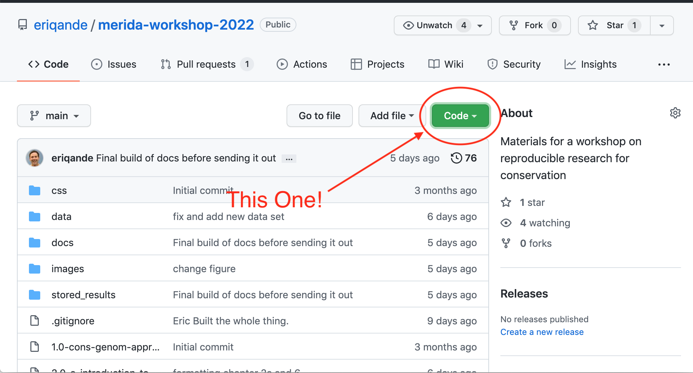
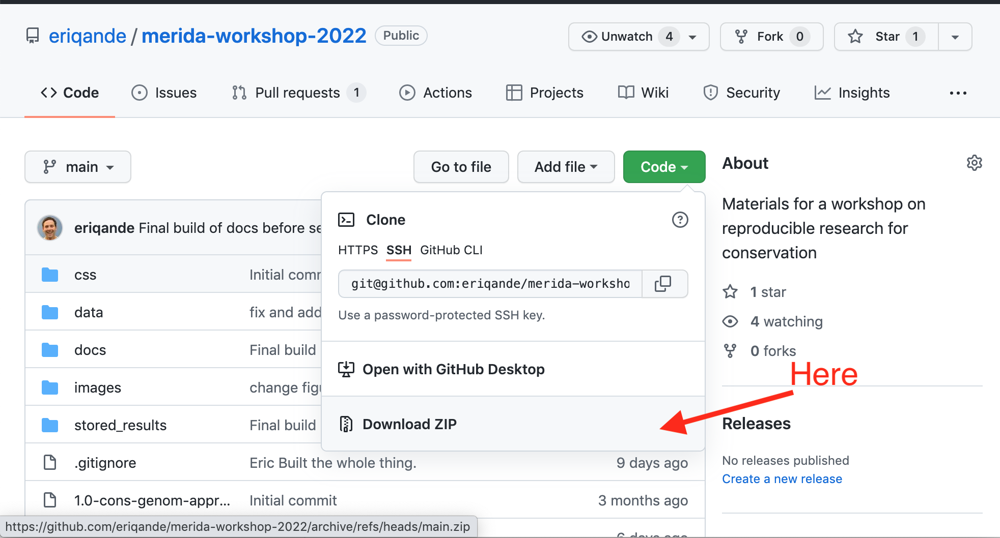
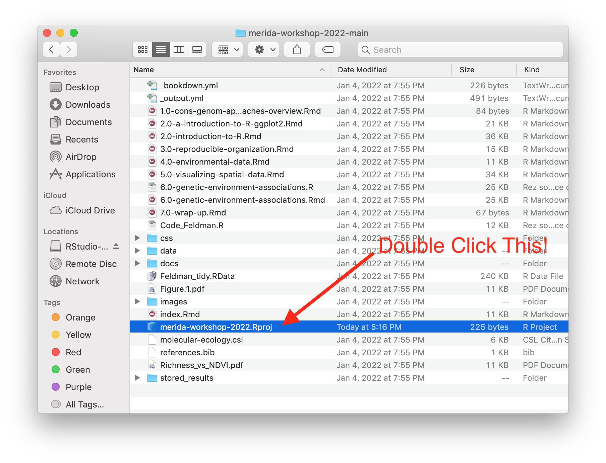

# Introduction to Conservation Genomics Approaches {#congen-intro}

This first presentation in the course is given by Dr. Kristen Ruegg.

There is not an accompanying narrative at this webpage, but you
can download a complete (24 Mb) PDF of her slides at:
[https://drive.google.com/uc?export=download&id=1VoE26VT9_judMT0rH2V3jy7MDX3ZgYk7](https://drive.google.com/uc?export=download&id=1VoE26VT9_judMT0rH2V3jy7MDX3ZgYk7).

For the group activity, you can download the necessary portion
of her slides at:
[https://drive.google.com/uc?export=download&id=1cgFgBxHXaz8p0RaBtTX1oUMhBA61nRfW](https://drive.google.com/uc?export=download&id=1cgFgBxHXaz8p0RaBtTX1oUMhBA61nRfW)

The relevant paper by Allendorf et al. is at  [https://drive.google.com/uc?export=download&id=1iQiW6Wm-9FIdz0LLPPyJkETSBiYkhUZx](https://drive.google.com/uc?export=download&id=1iQiW6Wm-9FIdz0LLPPyJkETSBiYkhUZx)

The breakout room activity sides are at:
[https://docs.google.com/presentation/d/1-upYVY70-IxaG7GH246lKe1-GFrgs8emK2IBkO6Qm2Q/edit?usp=sharing](https://docs.google.com/presentation/d/1-upYVY70-IxaG7GH246lKe1-GFrgs8emK2IBkO6Qm2Q/edit?usp=sharing)

## After Kristen's Talk and the activity please download the course repository

To prepare for the interactive code sessions, it will be important
to download the raw material for this course website as an RStudio
Project.  This will provide you with all of the data sets and other
inputs needed for running all the examples. 

The easiest way to get this RStudio project is to download it as a .zip
file from GitHub,^[If you are comfortable with git, feel free to clone
the repo, but for others not comfortable with using git, it will be
easiest to simply download it using the directions given.], using the following
steps:

1. **In your web browser go to**: [https://github.com/eriqande/merida-workshop-2022](https://github.com/eriqande/merida-workshop-2022).

2. **Click the green "Code" button.**
  
  

  
  

3. From the context menu that pops up when you click that green button, **choose
_Download Zip_**
  
  

  
  
4. That will download a compressed folder that is an RStudio project.
You must uncompress it.  On a Mac, this is done simply by double clicking it.
On windows, make sure that all the files stay inside the directory that they
come in, which is called `merida-workshop-2022-main`.

5. Using Finder (on a mac) or File Explorer (on Windows) **navigate inside that
`merida-workshop-2022` directory** and **double click the file `merida-workshop-2022.Proj`**.  The `.Rproj` extension might not show up on your
computer, depending on your settings.  At any rate, it is an RStudio Project,
"proj" file.  Double clicking it will launch RStudio and open the project.
  

  
  

