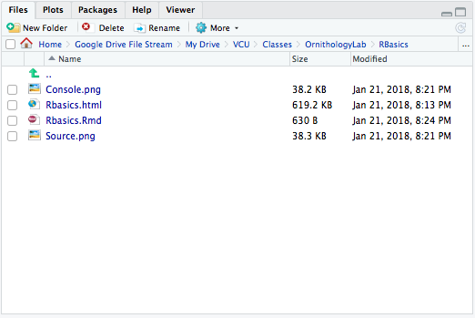

# Basic Introduction to R and ggplot

This is an introduction to R and ggplot2 that was created specificially for the UCMexus Conservation Genomics Workshop 2022.  The data used in this tutorial is a typical dataset used in ggplot.

## RStudio Layout

The RStudio layout is broken up into four panes: **Source**, **Console**, **Environment (history/connections)** and **Files (plots/packages/etc)**.  Within these panes there are additional tabs and we will go over the most important ones.  

```{r, echo=FALSE, out.width='100%'}
knitr::include_graphics("images/2.0_R_ggplot/RStudio.png")
```

The **Source** pane is where you can read, edit, and run your R code and the code can be saved as a *.R* file indicating it is an R script document.

```{r, echo=FALSE, out.width='75%'}
knitr::include_graphics("images/2.0_R_ggplot/Source.png")
```


An R document is written as a normal text document, however each line is a line of code in R.  However if you highlight a line and click **Run** (or type command-return), then the line of code will be executed and this activity will be displayed in the **Console**.

The **Console** pane is where the R code is executed and results are displayed, as well as other messages and warnings.

```{r, echo=FALSE, out.width='60%'}
knitr::include_graphics("images/2.0_R_ggplot/Console.png")
```
  
  
The **Environment** pane lists all available data and variables in the current session.  For example, in the example **Source** pane above I have a line of code `another_variable <- 5` which sets the string `another_variable` to represent the value 5.  After executing this line of code, the variable is stored and can be called at any point.  Once a variable has been created, it will be displayed in the **Environment**.  

*Note*: Whenever opening a script into a new session of R, you will need to re-run the lines of code you wish to use.  Opening a .R script does not automatically run the code.

```{r, echo=FALSE, out.width='75%'}
knitr::include_graphics("images/2.0_R_ggplot/Environment.png")
```

The **Files** pane is used to navigate through directories and can be used to open files directly into RStudio.  This will be useful when importing data into R.

```{r, echo=FALSE, out.width='60%'}

```

Next to the **Files** tab, there is **Plots**.  In the example **Source** pane above I created a plot with the following code (*note*: the function `ggplot()` and the `mpg` dataset are from the `ggplot2` package that comes in the `tidyverse` package. You need to have `tidyverse` installed and loaded for this code to work on your console, this is addressed further down). 

```{r}
library(tidyverse)
library(ggplot2)

p <- ggplot(data = mpg) +
        geom_point(mapping = aes(x = displ, y = hwy))
p
```
  
When this code is executed, the resulting scatterplot is displayed below. If this was run in a R script rather than an Rmarkdown, the plot would be displayed in the *Plots* window on the left.

Also useful is the **Help** tab for understanding what a function does.
    
##Data visualization with ggplot2
  
#Visualize
1. We want to understand our data and our analysis.
2. We want to produce graphics for publication and presentation.
    a. We want to create plots quickly and get many things “for free”.
    b. We want many options to customize and make things look awesome.

#ggplot2
ggplot2 uses the basic units of the “grammar of graphics” (Leland Wilkinson) to construct data visualizations in a layered approach.

The basic units in the “grammar of graphics” consist of:

*  The data or the actual information that is to be visualized.
*  The geometries, shortened to “geoms”, which describe the shapes that represent the data. These shapes can be dots on a scatter plot, bar charts on the graph, or a line to plot the data. Data are mapped to geoms.
*  The aesthetics, or the visual attributes of the plot, including the scales on the axes, the color, the fill, and other attributes concerning appearance

#Understanding the Ggplot Syntax
The syntax for constructing ggplots could be puzzling if you are a beginner or work primarily with base graphics. The main difference is that, unlike base graphics, ggplot works with dataframes and not individual vectors. All the data needed to make the plot is typically be contained within the dataframe supplied to the ggplot() itself or can be supplied to respective geoms. More on that later.

#A plot consists of components
The second noticeable feature is that you can keep enhancing the plot by adding more layers (and themes) to an existing plot created using the ggplot() function
  
#Verbose definition of a simple plot
Note, this is not something you will see/use. But it's a nice way to break down the components

Ok, let's break this down.

```{r}
ggplot() +
  layer(data = mtcars, #1
      mapping = aes(x = hp, y = qsec), #2
      geom = 'point', #3
      stat = 'identity', #4
      position = 'identity') + #5
  theme_bw()+
  theme(aspect.ratio = 1)
```

#1: Data
__layer(data = mtcars, #1__
  mapping = aes(x = hp, y = qsec), #2
  geom = 'point', #3
  stat = 'identity', #4
  position = 'identity') + #5

* A data layer needs data to display.
* Data is a data.frame or tibble if you are using tidyverse

```{r}
mtcars
msleep
iris
```

#2: What is a mapping?

layer(data = mtcars, #1
    __mapping = aes(x = hp, y = qsec), #2__
    geom = 'point', #3
    stat = 'identity', #4
    position = 'identity') + #5


*  An aesthetic mapping connects your data to your plot. (e.g. x, y, color, shape, alpha, size, linetype, etc.)
*  Aesthetics are “things that we can perceive on the graphic”.
*  We use the aes() function to create this mapping.
*  aes(aesthetic = variable)
*  Never use $! So never aes(x = mtcars$mpg)!

For the code:
```
aes(x = hp, y = qsec)
```

Here, we are mapping hp on the x-axis and qsec on the y-axis.

#3: What is a geom?

layer(data = mtcars, #1
    mapping = aes(x = hp, y = qsec), #2
    __geom = 'point', #3__
    stat = 'identity', #4
    position = 'identity') + #5

Simply the geometrical shape that you want to do draw.
*  0d: point, text,
*  1d: path, line (ordered path),
*  2d: polygon, interval, boxplot etc.
*  geoms translate the aesthetics into an actual plot.

Geoms determine what aesthetics you need, and which you can use! (e.g. points cannot display the linetype aesthetic.)
  
Which aesthetics you need/can use is usually obvious, but is also clearly documented.
  
#Simplifying the code
Instead of writing out the whole layer(), we can use geom_*() functions to create the layer for us. These functions use common defaults.

We simply write:

```{r}
ggplot() +
geom_point(mapping = aes(x = hp, y = qsec), data = mtcars) +
  theme_bw()+
  theme(aspect.ratio = 1)
```
  
Or, using positional matching:

```{r}
ggplot() + geom_point(aes(hp, qsec), mtcars)+
  theme_bw()+
  theme(aspect.ratio = 1)
```

Like geom_point(), there are many such geom layers which we will see in a subsequent part in this tutorial series. For now, let’s just add a smoothing layer using geom_smooth(method='lm'). Since the method is set as lm (short for linear model), it draws the line of best fit.

#How would you change color of the points to the cyl?
```{r}
ggplot() +
geom_point(aes(hp, qsec, color = cyl), mtcars)+
  theme(aspect.ratio = 1)
```

#Continious versus discrete variables
R treats continuous and discrete information differently
ggplot directly uses this information to figure out how to best display data.
The class of the variable is used:
In this case, it checks:
```{r}
class(mtcars$cyl)
```

For it to recognized as a category (with fitting colors) we need a factor:
```{r}
class(factor(mtcars$cyl))
```

Character strings are silently converted to factors:
```{r}
ggplot() +
geom_point(aes(hp, qsec, color = as.character(cyl)), mtcars) +
labs(color = 'cyl')
```


*  Some more on stats.
*  Scales.
*  Coordinate systems (brief).
*  Facets.
*  Themes.
*  Plotting model fits.
*  Some more challenges.

#Two special stats: stat_smooth
```{r}
g<-ggplot(mtcars,aes(hp, qsec)) +
  geom_point() + geom_smooth(method = lm, se = TRUE) +
  theme_bw()+theme(aspect.ratio = 1)
plot(g)
```

 `geom_smooth()` using method = 'loess' and formula 'y ~ x' but you can also specify a linear model with standard errors
 
 Note, how would you change the code above to change the color of the point layer, withuot affecting the color of the smooth layer since the aes() aesthetic mapping is passed at the point layer.

```{r}
g<-ggplot(mtcars,aes(hp, qsec,color = as.character(cyl)) ) +
  geom_point() + geom_smooth(method = lm, se = TRUE, color="black") +
  theme_bw()+theme(aspect.ratio = 1)
plot(g)
```
Note, the code above would only change the color of the point layer, it would not affect the color of the smooth layer since the aes() aesthetic mapping is passed at the point layer.

###Exercises: Create the following plot

```{r, echo=FALSE, out.width='40%'}

```


```{r,echo=FALSE}
ggplot() +
geom_point(aes(hp, qsec, shape = factor(vs), size = mpg), mtcars,
alpha = 0.5, col = 'red') +
labs(shape = 'vs', size = 'qsec') +theme_bw() + theme(aspect.ratio = 1)
```

How about if we wanted to create a line plot with this data? How would you create the following plots create separate lines based on the variable am.

```{r}
ggplot() +
geom_line(aes(hp, qsec,lty = factor(am)), mtcars) + theme_bw()+theme(aspect.ratio = 1)
```

Now what if we want to add labels. Let's look at another dataset and think about this- now we have multiple layers. You might've noticed this with the geom_smooth function too.

Shared data and mapping
*  When multiple layers share the same data or mapping you can define it inside of ggplot.
*  Everything in ggplot will be used by default for all layers.
*  Use data inside a layer in order to not use the default.
*  Set or map an aesthetic to not use the default. You can map to NULL.
*  This goes for each aesthetic individually! Not for the entire mapping.
 
 
```
ggplot(d, aes(x, y, col = z)) + geom_point(aes(col = NULL))
ggplot(d, aes(x, y, col = z)) + geom_point(col = 'black')
```

In many cases I provide the data and mapping in ggplot.
```{r}
ggplot(msleep,aes(sleep_total, log(brainwt), label = name, col=vore)) + #make sure to add the label aes!
    geom_point() + # then add a layer of points 
    geom_text(size=3) # and then add labels to the points
```
 But this is a bit busy and messy. Let's move around the names to make this more readable (less overlap)! Let's also fix the axis names.
 
```{r}
 ggplot(msleep,aes(sleep_total, log(brainwt), label = name, col=vore)) + #make sure to add the label aes!
    geom_point() + # then add a layer of points 
    geom_text(check_overlap = T,# automatically reduce overlap (deletes some labels)
              vjust = "bottom", # adjust the vertical orientation
              nudge_y = 0.1, # move the text up a bit so it doesn't touch the points
              angle = 30,# tilt the text 30 degrees
              size = 2) + # make the text smaller (to reduce overlap more)
   labs(title = "Sleeping habits of mammals given their brain weight", # plot title
         x = "Sleep Total", # x axis label
         y = "log(brain weight)" # y axis label
        )
```
Note above, there are some points without labels. Here's another way to add labels to your plot with ggrepel. 

```{r}
library(ggrepel)
ggplot(msleep,aes(sleep_total, log(brainwt), label = name, col=vore)) + #make sure to add the label aes!
    geom_point() + # then add a layer of points 
    geom_text_repel(vjust = "bottom", # adjust the vertical orientation
              nudge_y = 0.1, # move the text up a bit so it doesn't touch the points
              angle = 30,# tilt the text 30 degrees
              size = 2) + # make the text smaller (to reduce overlap more)
   labs(title = "Sleeping habits of mammals given their brain weight", # plot title
         x = "Sleep Total", # x axis label
         y = "log(brain weight)" # y axis label
        )
```
Summary so far
We know:
*  How to produce simple plots.
*  How to map data to aesthetics.
*  How to combine multiple layers.


#4. What is a stat?

layer(data = mtcars, #1
mapping = aes(x = hp, y = qsec), #2
geom = 'point', #3
__stat = 'identity', #4__
position = 'identity') + #5

Often, you don’t want to directly plot the actual data, but rather some transformation of the data.

stats perform all kinds of data transformations.

The most common transformations:
*  binning (StatBin)
*  counting (StatCount)
*  summing (StatSum)
*  averaging (StatSummary)
*  smoothing (StatSmooth)
*  boxplots (StatBoxplot)
*  densities (StatDensity)
*  nothing (StatIdentity)

#Example

geom_* functions have default stats.
E.g. ?geom_boxplot shows stat = "boxplot".


```{r}
ggplot() +
geom_boxplot(aes(factor(cyl), hp),mtcars) +
xlab('cyl') +theme_bw()+theme(aspect.ratio = 1)
```

#One variable exercises
How would you create the following plots?
```{r, echo=FALSE, out.width='40%'}

```

First plot. A simple histogram, and we use the stats binning:

```{r}
ggplot(mtcars, aes(hp)) +
geom_histogram(bins = 10)
```


#5. What is a position?
layer(data = mtcars, #1
mapping = aes(x = hp, y = qsec), #2
geom = 'point', #3
stat = 'identity', #4
__position = 'identity') + #5__

Things in a plot can overlap. This is very common with categorical axes and overlap can be resolved by using a position

Most commonly you:
*  stack (put on top of each other)
*  fill (stack in proportion, up to 1)
*  dodge (put next to each other)
*  jitter (add random noise)
*  leave as is: identity

For exmaple, the default of geom_bar is stacked: geom_bar(position = "stack")

```{r}
ggplot(mtcars, aes(factor(cyl), fill = factor(am))) +
geom_bar(position = 'fill')
```
To dodge the barplots:
```{r}
ggplot(mtcars, aes(factor(cyl), fill = factor(am))) +
  geom_bar(position = 'dodge')
```


Let's add some labels here, where we have to specify position again.

```{r}
ggplot(mtcars, aes(factor(cyl),fill = factor(am))) +
  geom_bar() +
  geom_label(aes(label = ..count..), 
             stat = 'count', 
             position = 'stack')
```

Instead of defining the position as a string (e.g. position = "dodge"), you can write it as a full function
with arguments (e.g. position = position_dodge(width = 0.5)) or tell ggplot where within the boxplot you'd like to posiiton the counts specifically (e.g position = position_stack(vjust=0.5)).

```{r}
ggplot(mtcars, aes(factor(cyl), fill = factor(am))) +
  geom_bar() +
  geom_text(aes(label = ..count..),
            stat = 'count',
            position = position_stack(vjust = 0.5))
```

