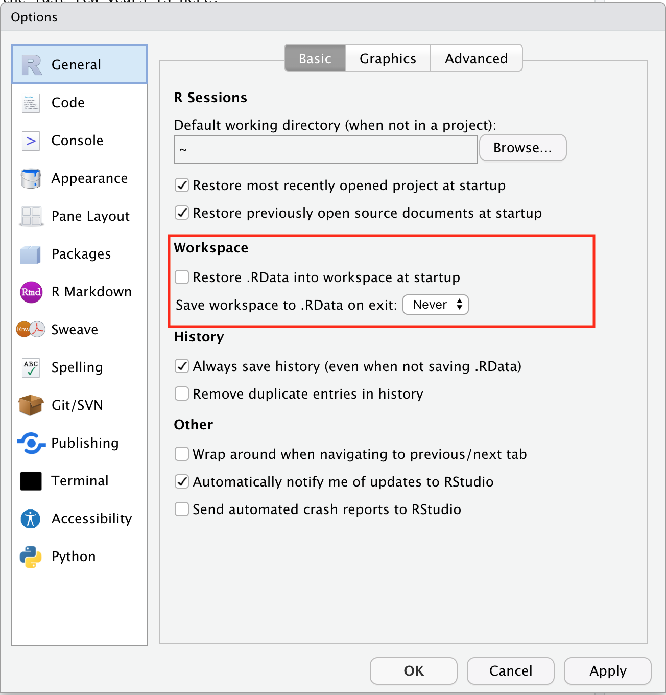
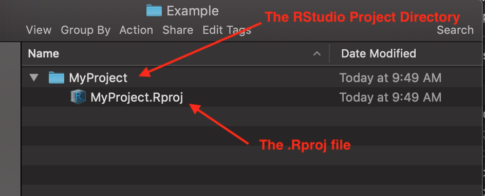

# Organizing Research Projects for Reproducibility {#reporg}

## Goals for this session

1. Learn strategies to make our research and particularly our
data analyses _reproducible_.
2. _Reproducible_ here means that we can 
    a. easily send someone a directory filled with 
       data and scripts, _and_
    b. it is nearly effortless for that person to
       re-run your entire analysis, regenerating all of
       your results, figures, and tables, _and_
    c. it is clear what all the different files and parts of
       your analysis project are, and the order that they must
       be run in.
    d. there is no part of the analysis that is done "by hand." (i.e.,
       no data formatting is done by copying and pasting columns of
       data in Excel.)
3. The focus here is on using RStudio for make usefully reproducible
   projects within R.  
   
The ideal we will be striving for is to be able to start from a raw data set and then write a computer program that conducts all the cleaning, manipulation, and analysis of the data, and presentation of the results, in an automated fashion.

## Why do this?

Carrying out analyses in this way carries a number of advantages to the researcher:

* Newly-collected data can be integrated easily into your analysis.
* If a mistake is found in one section of your analysis, it is not terribly onerous to correct it and then re-run all the downstream analyses.
* Revising a manuscript to address referee comments can be done quickly.
* Years after publication, the exact steps taken to analyze the data will still be available should anyone ask you how, exactly, you did an analysis!
* If you have to conduct similar analyses and produce similar reports on a regular bias with new data each time, you might be able to do this readily by merely updating your data and then automatically producing the entire report.
* If someone finds an error in your work, they can fix it and then easily show you exactly what they did to fix it.
  
  
  
Making research reproducible is good for the community:

* Others that would like to confirm your results can do so easily.
* Someone wanting to apply your methods to their own data can easily do so.
* Reproducibility makes it easier for everyone to learn more quickly from
    what their colleagues have done.


Finally:

* Most journals require, _at a minimum_, that the raw data used in a paper be
    publicly archived and accessible.
* Increasingly, journals require all the analysis code as well.

If you have emphasized reproducibility throughout your project, these last two
are quite easy.


## What can this look like?

Using R, RStudio and RMarkdown, and freely available tools and services such as git
and GitHub, it is possible to publish a reproducible project "website" that is
part of a GitHub repository that holds everything needed to reproduce all the
results.

One example from a project I did in the last few years is here:
[https://eriqande.github.io/thompson-et-al-2020-chinook-salmon-migration-timing/index.html](https://eriqande.github.io/thompson-et-al-2020-chinook-salmon-migration-timing/index.html)

It took a fair bit to put that together, but I find that I go back to it all
the time to direct colleagues and others to the code for certain
analyses.

## Reproducibility Edict #1: Don't Save Your R Workspace and then Reload It

R has a feature that lets you save your entire workspace, and then, at a later time,
reload it so that you can keep working.

* Don't do it.
* It is too easy to create R objects but not save the
code that produced them when saving and loading `.Rdata`.
* "Save the code, not the workspace."

Also, in RStudio's Global Options/Prefernces, make sure to disable
automatic saving of your workspace in RStudio and
_never_ automatically load .Rdata when you open RStudio:
  
  
```{r, echo=FALSE}

```
  
  
## Paths, an important concept for reproducibility

* On your computer system, files can be stored inside directories.
* A file's location relative to the _root_ of your computer's filesystem
is called its _absolute path_.

For example, on Windows:
```sh
# the root is C:
"C:\Documents and Settings\Eric\My Documents\mydoc.txt"
```
Or on Mac:
```sh
# the root is /
/Users/eriq/Documents/git-repos/merida-workshop-2022/merida-workshop-2022.Rproj
```

Absolute Paths are, almost by definition, _NOT_ reproducible. Everyone
has their computer set up differently.

If I am trying to run a script that my friend, Devon, gave me, and
one of his lines of code is:
```r
read_csv("/Users/devon/Documents/stuff/data.csv")
```
Then, _that will not work for me_.  In order to make that work,
I would have to get the file `data.csv` separately, put the it somewhere
on my computer, and then change the line of code above to reflect
that file's location on my computer.

What a hassle!!


## The Working Directory

When R is running, it finds itself "stationed" in what is
called the "working directory".  For any R session, at any time,
that directory can be found with:
```{r}
getwd()
```
Everybody try that.

### A Hugely Important Point!

When you open an RStudio project, the working directory is always
automatically set to the Project Directory---that is, the directory
that holds the .Rproj file.

If you have disabled automatic loading of the `.Rdata` file, then
the R environment will also be completely empty---a blank slate!---when
you open an RStudio project.

That is how every analysis should start.


### Skeletal anatomy of an RStudio Project
  
  
```{r, echo=FALSE, out.width='65%', fig.align='center'}

```
  

* The Project is basically everything that is inside the Project Directory.
* The .Rproj file is just a text file listing a few preferences, but your operating
system recognizes it as an RStudio file.  So, when you double-click it, it will open
the project up in RStudio.  (This is a good way to open RStudio projects...)


## Reproducibility Edict #2: Don't Change Directories in Your Code

The companion function to `getwd()` is `setwd()` which lets you
change the working directory.  Generally you almost _never_ want to
use `setwd()` in your code.


## Relative Paths

A relative path is a path that starts from the working directory. For example, if the
working directory contains a file called `time-series.csv`, then this will read it:
```{r, eval=FALSE}
read_csv("time-series.csv")
```

If the working directory holds a directory called `data`, inside of which
is a file called `abundance.csv`, then this will work:
```{r, eval=FALSE}
read_csv("data/abundance.csv")
```

## Reproducibility Edict #3: Always Use Relative Paths from the Project Directory to Files _inside_ the Project Directory

You should plan on having an RStudio Project for every project that you work on,
where, roughly, a project correponds to the work undertaken for a paper, publication,
thesis chapter, report, etc.

* Everything needed to reproduce the analysis should be included withing the Project Directory.
* Assume the working directory is the Project Directory.
* Reading files, use relative paths.

This way, the Project Directory has all the data and files needed to run the whole
analysis.

You can just give an RStudio Project to someone and they can run everything
without changing paths, etc.

```{r, eval=FALSE}
# good
read_csv("data/abundance.csv")
read_csv("time-series.csv")
source("R/my-functions.R")

# bad:
read_csv("/Users/eriq/files/data/abundance.csv")
read_csv("C:/Documents and Settings/data/abundance.csv")
source("../../../useful_stuff/my-functions.R")
```

Note, the last "bad" example above uses a relative path to a file
that is _outside_ of the Project Directory.


## Reproducibility Edict #4: Put data files into a `data` directory

This `data` directory should be at the top level of the Project Directory.

## Reproducibility Edict #5: Write Analysis Scripts as `.R` or `.Rmd` files

* These scripts/RMarkdown-documents/notebooks should be at the _top level_
of the Project Directory
* These should be named with a leading number (I like three digits, like `001`, `002`, etc.)
that gives the _order_ in which they should be executed.

Sometimes later scripts use, as inputs, outputs from earlier scripts,
in which case the order that they are run in becomes paramount.


## Download an example project to play with

At this juncture, let's all download a simple RStudio project to play
with.  The project is at:

[https://github.com/eriqande/small_project](https://github.com/eriqande/small_project)

You can either:

* navigate there with a browser, click the green "code" button and "Download ZIP"; then expand that zip archive into a single Project Directory.

When you have it, navigate into the `small_project` directory
and double click the `small_project.Rproj` file to open the project
in RStudio.


* if you have git, then you can open the project directly from RStudio
using:  File->New Project->Version Control->Git and then put:
```{sh, eval=FALSE}
https://github.com/eriqande/small_project.git
```
into the Repository URL box.

### Let's have a moment

Take a moment to open up that project, and try to evaluate
the notebooks:

- `001-read-and-format.Rmd`
- `002-plot-data.Rmd`

Let's discuss the structure of the project and have time for questions.

In particular let's talk about the R Notebook format: a combination of
explanatory text and code chunks that provides a way of
cleanly documenting your findings.

## Reproducibility Edict #6: Write your code with style!

R code is a lot easier to read when it is formatted in a consistent
style.  Your homework is to read the [Tidyverse Style Guide)[https://style.tidyverse.org/].
It takes about an hour and is extremely informative.  

Following the guidelines in the style guide will make it easier for you
(and others) to read and understand your code.


## What About Shared Data Sets?

A quick sidebar about the 'googlesheets4' package.

* For some projects, you might want to retrieve data that your
research team keeps centralized.
* Often that will be in a data base.  In that case there are
ways of accessing those data bases through R (but that is
beyond the scope of today's exploration.)
* Other times, pertinent information might be stored in a shared
Google Sheet (that is Google's Spreadsheet Format).

For example, your lab might keep meta data about samples of birds or fish in a Google
Sheet that is shared among lab members and is being frequently updated.

For some projects (like for permit reporting requirements) it might be nice to
have R code that directly accesses the current version of that document.

You can!

If you don't already have 'googlesheets4' package, then:
```{r, eval=FALSE}
install.packages("googlesheets4")
```

Imagine that someone has shared this [Google Sheet](https://docs.google.com/spreadsheets/d/1-7qG0X8M0TmyzB4Jaad6pNhV_SmcOY6T5JJk53dFU50/edit?usp=sharing)
with you.  Click the link to view it.

This is a publicly accessible sheet of data, so no authentication is needed to
view it.  Thus you can do:
```{r}
library(googlesheets4) 

# this is just storing the web address of the sheet
sheet_url <- "https://docs.google.com/spreadsheets/d/1-7qG0X8M0TmyzB4Jaad6pNhV_SmcOY6T5JJk53dFU50/edit?usp=sharing"

# this tells R to not bother with Google authentication for this session
gs4_deauth()

fish_sheet <- read_sheet(sheet_url)

fish_sheet
```

If you are using this to access a sheet that is not publicly shared, then
omit the `gs4_deauth()` command (in a new R session), and R will send you to your
browser to authenticate with a google account. (It is quite simple and user friendly!)

More information is at the [googlesheets4 web page](https://googlesheets4.tidyverse.org/).

## Reproducibility Edict #7: Use git for Version Control

RStudio provides one the cleanest, nicest interfaces, anywhere,
for using git.

Instructions to install git can be found within the comprehensive
online book, by Jenny Bryan, [happygitwithr](https://happygitwithr.com/install-git.html).

Accomplishing that with everyone in the short time we have would
be difficult.  But I encourage those who do not yet use git and GitHub
to run through the happygitwithr book to get it all set up and start using it.

## In the meantime, a short demo of git/GitHub on RStudio

Just to show, visually, what it looks like, using our small project
example.

## What to keep under version control and what not to

In general,

*  keep data and code under version control
*  do not keep outputs and intermediate files under version control

Exceptions that we will talk about:

- Very large data sets
- HTML files from RMarkdown that you might want to use in a website.

## Create a README to describe the parts of your analysis project

You should always have a README file that describes the project,
so that people you give it to will have a starting point, and you
will be able to refresh your memory if you come back to it after
a long time.

The best way to make such a README is to use an RMarkdown file,
`README.Rmd` that creates a markdown file `README.md` that can be
rendered by GitHub.

Such a file can be made from within RStudio by choosing
`File->New File->R Markdown...->From Template->GitHub Document
An example `README.Rmd` is in the `small-project`.  


## GitHub and Very large data sets

If you have a very large data file, that you don't want to put on GitHub
(or it is too large for GitHub to accept), you can use the 
the `googledrive` package.

This lets you store large data sets on Google Drive, and then download
them automatically from your R code, when you run the scripts in your
project.

This also allows for authentication so that you can keep private, large data
sets on Google Drive, safely.

Here is a [link](https://drive.google.com/file/d/1071-7teo1dIPl9cJNigTYrBGN7I0E08U/view?usp=sharing)
to a small data set that I put up, publicly available
on Google Drive.  It is a serialized R data object (`.rds`) file.

If you click on that link, your browser will be sent to a page
that asks if you want to download the data set.

But, you could access it directly from within R with the 'googledrive' package
like this.

First, get the package if you don't already have it.
```{r, eval=FALSE}
# if you don't have the googledrive package
install.packages("googledrive")
```

Then, download it and read it (with `read_rds()`) in one line:
```{r}
library(googledrive)

# since the data are publicly available on my google drive
# we will not worry about authentication.  To get private
# data at a different link, you would remove this and
# run through the authentication process.
drive_deauth()

# here is the URL for the google drive file.
url <- "https://drive.google.com/file/d/1071-7teo1dIPl9cJNigTYrBGN7I0E08U/view?usp=sharing"

download_results <- drive_download(url, overwrite = TRUE) 

readr::read_rds(download_results$local_path[1])
```

More details can be found at the [googledrive web page](https://googledrive.tidyverse.org/)


