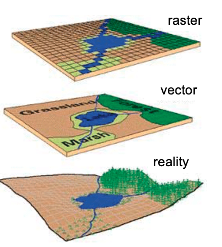
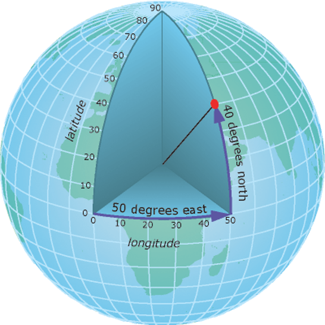
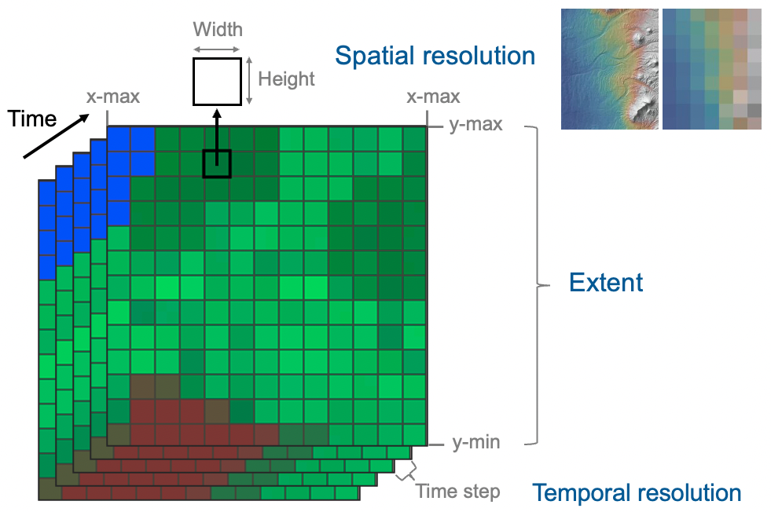

#  Finding and Obtaining Environmental Data for Conservation {#envdata}

Types of environmental data:

- direcly observed (satellite data)
- Interpolated or modeled etc.

Discussion of CRSs.

## Environmental Layers. A general overview

This section provides a brief narrative of Marius Someveille's
PowerPoint presentation.  We are trying to succinctly capture the
main points in this web/bookdown version so that it might easily
be translated with Google Translate.

Environmental layers in this context are _raster_ data they carry
information about particular "cells" or "pixels" of the earth's surface.
All of these terms will be defined in detail later. For now, here are a few
pictures of what environmental layers might look like when they are plotted
and displayed:
  
```{r, echo=FALSE, out.width='100%'}
knitr::include_graphics("images/env_layers/three-layers-intro.png")
```
  
  
### Environmental layers in conservation genetics

#### Landscape connectivity analysis (gene flow)

Connectivity is essential for long term persistence of populations and metapopulations as it affects gene flow. Functional connectivity is the degree to which individuals move through a landscape, which is affected by landscape features and environmental heterogeneity. Landscape genetics tests which landscape and environmental factors best explain genetic connectivity among populations and highlights which landscape features need to be maintained or enhanced to facilitate connectivity (gene flow) for different species. 

For example, @robertson2018regional studied frogs in multiple locations in
North America, shown here:
  
```{r, echo=FALSE, out.width='90%', fig.align='center'}
knitr::include_graphics("images/env_layers/robertson-land-cover.png")
``` 
  
The positions of samples are shown here on a map that was created from
land cover data.  However, many other layers area available, giving information
of, for example, topography, temperature, and moisture levels in the different
locations.  Landscape genetics approaches were used to identify which of these 
features were most associated with connectivity between populations in
each of the different regions (i.e, different colors on the map).  They summarized
those results as follows:
  
```{r, echo=FALSE, out.width='90%', fig.align='center'}
knitr::include_graphics("images/env_layers/robertson-table.png")
``` 
  
  
#### Environmental Niche Analysis

@ruegg2021linking shows another example of the use of environmental layers
in conservation genetics.  In this case, genetic differences resolved separate
breeding populations of the Willow Flycatcher, _Empidonax traillii_, in North America, and also made it
possible to identify where birds from each breeding population spend their
winters, as shown in the following figure (in which the different breeding
populations are denoted by different colors):
  
```{r, echo=FALSE, out.width='90%', fig.align='center'}
knitr::include_graphics("images/env_layers/wifl-map.png")
``` 

With the breeding and wintering areas for each subpopulation identified,
climate layers (temperature and precipitation) were used to identify the climatic conditions that defined the birds breeding and wintering
_niches_ for the subpopulations. Population trends were found to be associated
with overlap between breeding and wintering niches, with the subpopulation showing 
the least niche overlap being the only subpopulation not showing a decreasing trend.
  
```{r, echo=FALSE, out.width='90%', fig.align='center'}
knitr::include_graphics("images/env_layers/wifl-niches.png")
``` 


#### Genome-environment association to study vulnerability

Associations between genetic variation and environmental variation
(that we will hear about from Christen Bossu!) can be used to identify
places where there is expected to be a mismatch between expected genetic patterns
and environmental conditions after changes due to climate change.  One of the first
papers documenting this was @bay2018genomic.  

In their study, a variety of environmental predictors (BIO18, BIO15, etc.), whose
values across space are represented by environmental layer data, were found to
be associated with genetic variation, as shown in the following montage of
figures from the paper:
  
```{r, echo=FALSE, out.width='90%', fig.align='center'}
knitr::include_graphics("images/env_layers/bay-science.png")
``` 
  
  
#### Environmental layers as raster data

Digital environmental layers are obtained by abstracting reality in either _vector_ or _raster_ format, as shown below: 

```{r, echo=FALSE, out.width='90%', fig.align='center'}

``` 

The most common format encountered is _raster_, which is composed of a grid of cells.

```{r, echo=FALSE, out.width='90%', fig.align='center'}
knitr::include_graphics("images/env_layers/raster.png")
``` 

A cell value can represent a measured value at the center point of the cell (e.g. elevation) or for the whole cell square (average, max, category). The cell values represent the phenomenon portrayed by the raster dataset such as a category (e.g. grassland, forest, road), magnitude (e.g. noise pollution, rainfall), height (e.g. elevation), or spectral value. Cell values can be either positive or negative, integer, or floating point. 

Commonly used format to store _rasters_ on a computer are: TIFF, Hierarchichal Data Format (HDF), JPEG, NetCDF.


#### Coordinate system and projections

For geographic analysis, we use a coordinate system that uses a three-dimensional spherical surface to determine location on the Earth. Each point on Earth is defined by a latitude value and a longitude value, which are measures of angle as shown in the following figure:

```{r, echo=FALSE, out.width='90%', fig.align='center'}

``` 

The units of the _geographic coordinate system_ are units of angle as follows: 1 degree = 60 arc-minutes = 3600 arc-seconds.

To visualize geographic data as maps, we need to draw it on a two-dimensional surface using a _projected coordinate system_. _Map projections_ tell how to distort the earth so that it is displayed on a flat surface. A _coordinate reference system_ (CRS) then defines how the projected map is related to real places on the earth. Many _projections_ exist, here are some examples:

```{r, echo=FALSE, out.width='90%', fig.align='center'}
knitr::include_graphics("images/env_layers/projections.png")
``` 

Good practice: raster data storing environmental layers should have a projection, and you choose one projection for the whole analysis, i.e. converting all of the geographic data into the same projection.


#### Parameters of raster data

Rasters storing environmental layers are defined by multiple parameters. The _extent_ is defined by the top, bottom, left, and right coordinates of the rectangular area covered by a raster. The _spatial resolution_ is defined by the width and height of cells/pixels (cells are square and the width and height of all cells have the same value), usually given in degree / arc-minute / arc-second. For environmental variables that have layers at different time, it is possible to _stack_ these layers and define a _temporal extent_. i.e. the first and last date, and _temporal resolution_, which is the time step (e.g. daily, weekly, monthly, yearly).

```{r, echo=FALSE, out.width='90%', fig.align='center'}

``` 


#### Examples of climate layers

```{r tbl9, echo = FALSE}
tbl9 <- tibble::tribble(
~`Source`, ~`Method`, ~`Variables`, ~`Extent`, ~`Spatial resolution`, ~`Temporal resolution`,
"WorldClim","Interpolation of observations from weather stations","Temperature Precipitation Solar radiation BIOCLIM","Global","30 sec (~1km2) 2.5 min 5 min 10 min (~340 km2)","Monthly 1970 – 2000",
"Chelsa","Quasi-mechanistical downscale of global circulation model","Temperature Precipitation BIOCLIM","Global","30 arc sec (~1km2)","Monthly 1979 – 2018",
"Prism","Statistical model using weather station data  and atmospheric process","Temperature Precipitation","USA","30 arc sec (~1km2)","Monthly 1981–2010"
)

kableExtra::kable_styling(knitr::kable(tbl9), font_size = 14)
```

---

### Examples of atmospheric layers


```{r tbl10, echo = FALSE}
tbl10 <- tibble::tribble(
~`Source`, ~`Method`, ~`Variables`, ~`Extent`, ~`Spatial resolution`, ~`Temporal resolution`,
"NOAA Global Forecast System","Global atmospheric model","Wind direction Wind speed","Global","0.5 deg","6 times / day 2011 – present",
"WorldClim","Interpolation of observations from weather stations","Wind speed Water vapor pressure","Global","30 sec (~1km2) 2.5 min 5 min 10 min (~340 km2)","Monthly 1970 – 2000"
)

kableExtra::kable_styling(knitr::kable(tbl10), font_size = 14)
```

---


### Examples of vegetation layers

```{r tbl11, echo = FALSE}
tbl11 <- tibble::tribble(
~`Source`, ~`Method`, ~`Variables`, ~`Extent`, ~`Spatial resolution`, ~`Temporal resolution`,
"VIP30 (NASA)","Remote sensing using spectrometer on board satellites","NDVI EVI","Global","0.05 deg ~5.6km","Monthly 1981 – 2014",
"Copernicus (ESA)","Remote sensing using spectrometer on board satellites","NDVI EVI","Global","300m","10-day Present",
"GEDI (NASA)","Remote sensing using lidar (laser ranging) onboard the ISS","Vertical profile of vegetation: canopy height, canopy vertical structure, ground elevation ","51.6 deg N and S latitudes ","25m","Annual Present"
)

kableExtra::kable_styling(knitr::kable(tbl11), font_size = 14)
```

---


### Examples of landscape layers

```{r tbl12, echo = FALSE}
tbl12 <- tibble::tribble(
~`Source`, ~`Method`, ~`Variables`, ~`Extent`, ~`Spatial resolution`, ~`Temporal resolution`,
"SRTM (NASA)","Remote sensing using radar onboard satellites","Elevation","Global","1 arc-second (~30m)","NA",
"MODIS (NASA)","Remote sensing using spectrometer onboard satellites","Snow cover","Global","30 arc-sec (~1km2)"," ",
"Copernicus (ESA)","remote sensing + random forest for classification","Land cover","Global","100m","NA",
"NASA Gridded Population of the World","Input data are census tables","Human population density","Global","30 arc-sec (~1km2) ","NA 2000–2020"
)

kableExtra::kable_styling(knitr::kable(tbl12), font_size = 14)
```

