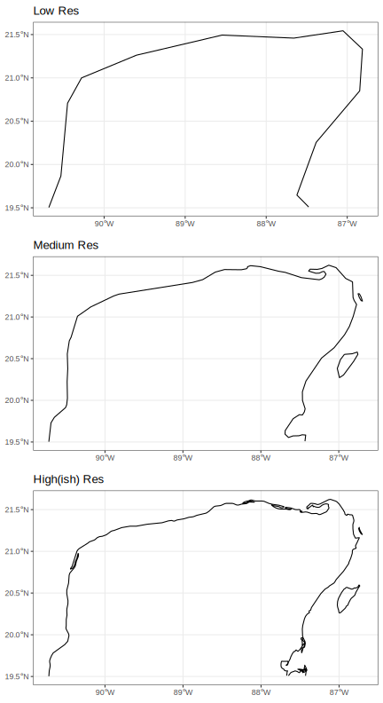
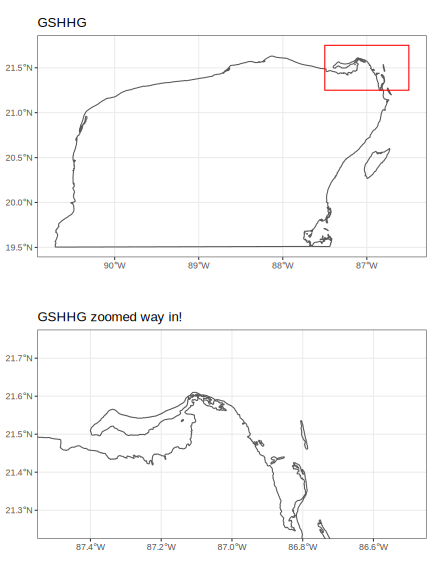

#  Handling and Visualizing Spatial Data in R {#spatdata}

In the previous session, Marius gave a very nice overview of _environmental_ data,
which is typically stored in _raster_ form.  He described properties of raster
data and how to find data sets relevant to biological questions.

In this session we give an overview of how to handle spatial data
in R.  Our topics are:

1. Handling raster data
2. Some background on spatial _vector_ data
3. Handling vector data in R.
4. Geometric operations on spatial data.
5. Plotting spatial data.


Let's load the main libraries that we will use for this session:
```{r, message=FALSE}
library(tidyverse)
library(terra)
library(sf)
```

## Handling Spatial Rasters in R

Regardless of where an environmental data set comes from, if it
is stored as a spatial raster it can be read into R and manipulated
as an R object.

Today, the main package for handling raster data in R is
'terra'.  

I have stored a few small raster data sets showing parts of the
Yucatán Peninsula in this repository for examples.
[This section](#spat_data_appendix) provides some details about how these 
small data sets were obtained.

### Reading and Printing Raster Data

Let us read in two different raster data sets.  The first shows average maximum
temperature across space around the Yucatán Peninsula in each of the twelve months,
and the second shows the values of different BioClim bioclimatic variables over space.

We read them in using the `rast()` function from the 'terra' package:
```{r}
yuc_tmax <- rast("data/spatial/worldclim/yp_tmax.tif")
yuc_bioc <- rast("data/spatial/worldclim/yp_bioc.tif")
```

These are stored as `SpatRaster` objects. This is a particular class from
the 'terra' package.  When we print them we see some relevant information
about them:
```{r}
yuc_tmax
```
Or
```{r}
yuc_bioc
```

This output gives information about the parameters of environmental data that
Marius has just told us about: for example, the _extent_ (`extent`) of the raster, the
_coordinate reference system_ and _projection_ (`coord. ref.`) and the _resolution_
(`resolution`) of the environmental data.

There are two lines that I want to emphasize, in particular.
```
dimensions  : 270, 540, 12  (nrow, ncol, nlyr)
```
This tells us the number of rows and columns in the raster, and also very importantly,
tells us how many _layers_ are in this SpatRaster object.  In this case there are 12 layers,
one for each month. 

The line
```
names       : MEX_1, MEX_2, MEX_3, MEX_4, MEX_5, MEX_6, ... 
```
Gives us the names for each layer.

There are many ways to manipulate SpatRaster objects. We won't go into many,
at this point, other
than to say that you can extract specific layers like
```{r}
yuc_tmax$MEX_10
```

For a great introduction to all the ways you can manipulation rasters
with functions from the 'terra' package, see the 'terra' documentation
at: [https://rspatial.org/terra/spatial/index.html](https://rspatial.org/terra/spatial/index.html).

### Plotting Raster Data with `plot()`

The easiest way to plot raster data, in order to get an overview of
the values in a raster, is to use the `plot()` function, which, if the
'terra' package is available, has a special set of methods for dealing
with SpatRaster objects.

This `plot()` function is optimized for raster data, and renders photos quite
quickly.  It uses a default color scheme for the continuous numeric values
in each cell of the raster, and it plots each layer as a separate panel.

For example, let's look at the maximum temperature
data:
```{r}
plot(yuc_tmax)
```

The 12 different panels here correspond to the twelve different layers in the
`SpatRaster`, each of these corresponding to one of the twelve months of
the year.


Take a moment to investigate those plots and ponder questions like:

- Where is it the coolest? Where it is the warmest?
- Which month appears to have the most/least variation in temperature across
the Peninsula?

It is also worth plotting the BioClim data to see how much these
bioclimatic variables differ across the Peninsula:
```{r}
# Use maxnl == 20 to make sure all 19 layers are plotted
plot(yuc_bioc, maxnl = 20)
```

This is really cool to see! Especially for someone that is not super familiar
with the Yucatán---there is a lot of biologically relevant climatic variation
across the peninsula.

So, what do all these, `bio_1` through `bio_16` mean?  They are defined as
follows:

* BIO1 = Annual Mean Temperature
* BIO2 = Mean Diurnal Range (Mean of monthly (max temp - min temp))
* BIO3 = Isothermality (BIO2/BIO7) (×100)
* BIO4 = Temperature Seasonality (standard deviation ×100)
* BIO5 = Max Temperature of Warmest Month
* BIO6 = Min Temperature of Coldest Month
* BIO7 = Temperature Annual Range (BIO5-BIO6)
* BIO8 = Mean Temperature of Wettest Quarter
* BIO9 = Mean Temperature of Driest Quarter
* BIO10 = Mean Temperature of Warmest Quarter
* BIO11 = Mean Temperature of Coldest Quarter
* BIO12 = Annual Precipitation
* BIO13 = Precipitation of Wettest Month
* BIO14 = Precipitation of Driest Month
* BIO15 = Precipitation Seasonality (Coefficient of Variation)
* BIO16 = Precipitation of Wettest Quarter
* BIO17 = Precipitation of Driest Quarter
* BIO18 = Precipitation of Warmest Quarter
* BIO19 = Precipitation of Coldest Quarter

So, this is really neat.  You can very quickly see that, although
there is not a huge amount of temperature variation, there
is quite a bit of variation in precipitation across the
peninsula.

### Plotting raster data with ggplot2

`ggplot` only knows how to plot data that are stored in data frames
or tibbles.  This means that you cannot hand it a `SpatRaster` object
directly for plotting.  

There is some support for ggplot from the authors of the 'terra' package,
in a package called 'rasterVis'.  This doesn't seem quite ready for
prime time yet (i.e., the version on CRAN has some bugs in it.)

Alternatively, if you have very large rasters with colors defined by levels
of red, blue, and green, there are fast alternatives to include those within
ggplot (See CH's session next!)

Otherwise, the simplest approach to getting all the features of ggplot
for plotting rasters is just to convert the information in the raster to
a data frame.  This can be done with `as.data.frame()`, as described
by the help information at `?terra::as.data.frame()`.

When applied to a `SpatRaster` object, `as.data.frame()` creates a column in a
data frame for every layer of the raster.  If you, additionally, set
`xy = TRUE`, then the center coordinates of each raster cell are included
in that data frame.  

Thus, we can make a tibble out of a raster and then put everything into
four columns, such that it is easy for ggplot to handle it:
```{r}
yuc_bioc_tib <- as.data.frame(
  yuc_bioc,
  xy = TRUE
) %>%
  as_tibble() %>%
  pivot_longer(
    cols = -c(x, y),
    names_to = "layer", 
    values_to = "value"
  )

# see what that looks like:
yuc_bioc_tib
```

In that format, ggplot knows just what do do with it, and you can plot
it quite easily.  First, let's just plot one of the variables, BIO_1:
```{r}
yuc_bioc_tib %>%
  filter(layer == "wc2.1_30s_bio_1") %>%
  ggplot(aes(x = x, y = y, fill = value)) +
  scale_fill_viridis_c(option = "magma") +
  geom_raster() +
  theme_bw() +
  coord_sf()  # here, this maintains the aspect ratio
  
```

One important thing to note: if you want to plot all the different bioclim
variables in ggplot using faceting, there is a problem --- the colors
will apply to the whole range of possible values, so that most won't show
up well.  This is especially obvious with the bioclim variables which
are on totally different scales:
```{r}
ggplot(yuc_bioc_tib, aes(x = x, y = y, fill = value)) +
  scale_fill_viridis_c(option = "magma") +
  geom_raster() +
  theme_bw() +
  coord_sf() +
  facet_wrap(~layer, ncol = 5)
```

Ha! That looks terrible.

_On the other hand_, if every layer is plotting the same variable, then it can be
quite advantageous to have the same color bar for all layers.  For example, when
looking at the maximum temperature each month, it is actually better to have
the same colour scale for all plots:
```{r}
# get a tibble of the tmax values
yuc_tmax_tib <- as.data.frame(
  yuc_tmax,
  xy = TRUE
) %>%
  as_tibble() %>%
  pivot_longer(
    cols = -c(x, y),
    names_to = "layer", 
    values_to = "value"
  ) %>%
  mutate(
    # here make a factor of them so they came out in the
    # right order
    layer_f = factor(layer, levels = unique(layer))
  )

# plot them
ggplot(yuc_tmax_tib, aes(x = x, y = y, fill = value)) +
  scale_fill_viridis_c(option = "magma") +
  geom_raster() +
  theme_bw() +
  coord_sf() +
  facet_wrap(~layer_f, ncol = 3)
  
```

That makes it a lot easier to see the annual variation in maximum temperature.


#### Quickly back to 'terra's `plot()` function

It is worth noting that a similar effect can be achieved by setting the
range in terra's `plot()` function:
```{r}
plot(yuc_tmax, range = c(27,38))
```

In summary, the `plot()` function from the terra package is fast and efficient
for plotting rasters.  However, if you are more comfortable making plots with
'ggplot2', you can use that for plotting rasters, but you need to
convert the raster to a data frame.  


## Vector Spatial Data

Raster data consist of a whole grid of _cells_ or _pixels_.  In this
way, they are very much like a digital photograph, or a JPG.  When you
zoom in on a raster, things get _pixelated_, just like a digital photograph.

Contrast this to when you zoom in on the text of a PDF file.  The edges of the
letters stay _smooth_ even at very high values of zoom.  That is because those letters
are not defined by lots of pixels (some white and some black), but rather, by
a _vector_ specification of the curves or lines that make up each letter.  

Spatial data has such an analogue known as _vector spatial data_.  This type of
spatial data is not defined in a series of cells, but rather in terms of
a number of different points.  

This can be much more efficient for storing spatial features that are lines or boundaries.
For example, two points in space can define a single line, which will not grow "fuzzy"
when you zoom in on it.  

Vector spatial data is particularly appropriate for representing things like
country boundaries, rivers, coastlines, the shorelines of lakes, highways and
roads, and points in space (for example, sampling locations of birds, etc.)

### Vector data features

There are three main _basic_ types of vector spatial data features:

1. **Points**: simply points on the landscape. (Like sampling locations.)
2. **Linestrings**: lines connecting a series of points (good for rivers or highways, etc.)
3. **Polygons**:  lines connecting a series of points that eventually come back to themselves
to create a closed shape.  (good for state boundaries, lakes, coastlines, etc.).

Polygons can be quite complex, as they may include holes (like a donut!), but, for the most
part, those complexities can remain hidden from you, the R user.

### Shapefiles

The most typical format for storing vector spatial data is the Shapefile, which
is commonly used for GIS programs, like ArcView.

A shapefile has the extension `.shp` and is a binary format describing the
vector data.  It is not human readable.  

Typically, along with the shapefile will be a number of other files with the
same first part of their name, but with different extensions, like
`.shx`, `.dbf`, `.prj`.  

For example, this course repository has a shapefile for the Mexican states
in the directory `data/spatial/ne_mexico_states` whose contents look like:
```
ne_mexico_states/
├── ne_mexico_states.dbf
├── ne_mexico_states.prj
├── ne_mexico_states.shp
└── ne_mexico_states.shx
```

It is worth pointing out that the `.prj` file contains information about the
projection of the points, and `.dbf` file contains data that correspond to
each of the geographic features in the shapefile.

[This section](#spat_data_appendix) provides some details about how the
Mexican states shapefile was obtained.

### Spatial vector data in R

There are a few different packages for handling spatial vector data in R.

'terra' can deal with it.

However, I am particularly fond of the package 'sf', which implements
_simple features_ for R. Simple features is a defined _standard_ for
representing spatial data.

The `sf` package stores spatial vector data in a special kind of data
frame that has any number of columns that represent data specific
to each row, and then a special list-column that contains the _geometry_
associated with the row.  This geometry is just a series of points
that define points, linestings, or polygons, _or_ collections of
multiple points, linestrings, or polygons.

All the functions in the 'sf' package start with `st_`.

Excellent introductory documentation for 'sf' is available at
[https://r-spatial.github.io/sf/articles/sf1.html](https://r-spatial.github.io/sf/articles/sf1.html),
and they have a great cheat sheet for the package too:

[](https://raw.githubusercontent.com/rstudio/cheatsheets/main/sf.pdf)


### An example: Mexican states

We can use the `st_read()` function to read in a shapefile of Mexican states.

```{r}
mex_states <- st_read("data/spatial/ne_mexico_states/ne_mexico_states.shp")
```

It turns out that there are _a lot_ of columns in that result.  To make it easier to
look at, let's just look at just a few of the columns.  We can do all the typical
tidyverse operations on this object, so we use `select()` to get a few columns,
and we make sure we get the `geometry` column, which has the spatial information in it!
```{r}
ms_thin <- mex_states %>%
  select(
    name,
    type,
    type_en,
    postal,
    geometry
  )

ms_thin
```
Here, we see that each state takes up 1 row, and the state boundary is stored
as a series of points in a "MULTIPOLYGON" sf data structure.

### Plotting simple features with `ggplot()`

The authors of the 'sf' package worked with Hadley Wickham to provide
the `geom_sf()` function to plot simple feature objects.  The `geom_sf()`
object does not require that aesthetics for `x` and `y` be set, because it
uses the geometry information directly. 

For example, we can plot the boundaries of the Mexican states like this:
```{r}
ggplot(data = ms_thin) +
  geom_sf(fill = NA) +
  theme_bw() +
  coord_sf()
```

Note that we can also map aesthetics like fill or color to different
values in the simple features data frame:
```{r}
ggplot(data = ms_thin) +
  geom_sf(aes(fill = name)) +
  theme_bw() +
  coord_sf()

```

### A word about `coord_sf()`

The `coord_sf()` function let's you define the coordinate
system for plotting `sf` objects.  By default, it plots
a planar system of longitude and latitude, but it also
accepts different projections with its `crs` argument.

Using a different `crs` will reproject any simple features data from whatever coordinate
reference system them are in to the new one.

For example, we can plot the Mexican states using a Lambert Conformal Conic (LCC)
projection, like this:
```{r}
# define the projection with this long string
mex_lcc <- "+proj=lcc +lat_1=20 +lat_2=60 +lat_0=40 +lon_0=-102 +x_0=0 +y_0=0 +ellps=GRS80 +datum=NAD83 +units=m no_defs"


# pass that string as the `crs` argument to coord_sf()
ggplot(data = ms_thin) +
  geom_sf(aes(fill = name)) +
  theme_bw() +
  coord_sf(crs = mex_lcc)

```

Note how the latitude lines are curved after projection.


### A word about _resolution_ of spatial vector data

You can zoom in indefinitely on vector defined _fonts_ (like in a PDF file)
because the curves that make up the letter are defined by equations.

That is not the case with most spatial vector data.  Rather, spatial
objects are defined by the points within them.  

Landforms are not perfectly straight lines, nor can they
be represented by simple equations. In fact, landforms have a fractal
nature.  So, the number of points used to represent a shape (like a coastline)
in space determines its _resolution_.  

We can demonstrate this by viewing the northern Yucatán coastline at
different resolutions. I previously downloaded Natural Earth Data maps
of different resolutions ([details here](#ne_resolutions))

```{r, echo=FALSE, out.width='70%', fig.align='center'}

```


Thus, spatial vector data still have a resolution, which is determined by how
many points are available to represent curvy lines.

If you are plotting maps of the entire world, low resolution works fine.  If you
are making maps of smaller areas, then higher resolution is needed.  

For very fine scale coastlines, you can use the U.S. National Oceanic and
Atmospheric Administration's
[Global Self-consistent, Hierarchical, High-resolution Geography Database (GSHHG)](https://www.ngdc.noaa.gov/mgg/shorelines/).

This is a very large data set, but clearly has much higher resolution:
```{r, echo=FALSE, out.width='70%', fig.align='center'}

```

In short, if you are working in small areas, then higher resolution
sources are needed.


## Yucatan Jay Occurrences

Today it is possible to collect a lot of data while using a GPS device.
This gives you an unprecedented ability to collect _georeferenced_ data.

In most cases, georeferenced data will correspond to samples that were
collected at different _points_. In other words, they represent point
data. 

These data are almost always given as variables with a latitude and
a longitude.  

### Example data set with Latitude and Longitude points

For an example of such data, I have downloaded 25,135 observations of the
Yucatán Jay from the GBIF data set and saved it in the course repository.
```{r, echo = FALSE, out.width = '80%', fig.align = 'center', fig.caption = 'Photo from: https://www.flickr.com/photos/kylasmith/5352589005'}

```

It can be read in like this:
```{r}
yjay_full <- read_tsv(
  "data/spatial/Cyanocorax-yucatanicus.tsv.gz",
  progress = FALSE, 
  show_col_types = FALSE
)
```

There are a lot of columns and rows in that.  So, let's make it a little
smaller by selecting only a few columns, and limiting it to 
EBIRD observations from the year 2017.

```{r}
yjay_thin <- yjay_full %>%
  filter(
    str_detect(collectionCode, "EBIRD"), # keep just the EBIRD-associated records
    year == 2017                         # from the year 2017
  ) %>%
  select(  # whittle it down to just a few columns of data
    gbifID,
    decimalLongitude,
    decimalLatitude,
    day,
    month,
    year,
    individualCount,
    stateProvince,
    locality
  )

# and look at the first few rows:
yjay_thin
```


### Plotting Lat-Long data

If you have lat-long data, you can typically plot them with `ggplot()` simply as points,
using `geom_point()`, _so long as your underlying maps and other spatial data
are all in a standard lat-long coordinate system_.

The geographic coordinates from GBIF (the Yucatán Jay data) use the WGS84 standard,
which is the same as the coordinate reference system of `ms_thin`, as seen by:
```{r}
st_crs(ms_thin)
```

Therefore, we can plot the Jay occurrence data like this:
```{r}
ggplot() +
  geom_sf(   # getting the background map
    data = ms_thin,
    fill = NA
  ) + 
  geom_point(  # placing the points
    data = yjay_thin, 
    mapping = aes(x = decimalLongitude, y = decimalLatitude),
    fill = "deepskyblue3",
    shape = 21,
    stroke = 0.2
  ) + 
  theme_bw() +
  coord_sf()

```

### But, `geom_point()` won't work with Different Projections / Coordinate Reference Sysytems

If you try to plot these with the LCC project from above things don't work out:
```{r}
ggplot() +
  geom_sf(   # getting the background map
    data = ms_thin,
    fill = NA
  ) + 
  geom_point(  # placing the points
    data = yjay_thin, 
    mapping = aes(x = decimalLongitude, y = decimalLatitude),
    fill = "deepskyblue3",
    shape = 21,
    stroke = 0.2
  ) + 
  theme_bw() +
  coord_sf(crs = mex_lcc)  # using projected coordinates!

```

The points are nowhere to be found(!), because the x and y coordinates
in an LCC projection and totally different!

This shows that if you want to do _spatial_ things on
georeferenced data that simply have lat-long coordinates,
you need to make a spatial object out of those data and
treat them as spatial objects.

Fortunately, that is fairly easy. 

### Turning something into a simple features object

The Jay data can be made an `sf` object by adding a geometry column to it.
This is done with `st_as_sf()`:
```{r}
yjay_sf <- yjay_thin %>%
  st_as_sf(
    coords = c(  # tell it which columns have the latitude and longitude
      "decimalLongitude",
      "decimalLatitude"
    ),
    crs = 4326  # this is the EPSG shorthand for WGS 84
  )

# have a look at it:
yjay_sf
```

Now, that `yjay_sf` variable can be treated as a spatial object and plotted
with `geom_sf()` like this:
```{r}
ggplot() +
  geom_sf(   # getting the background map
    data = ms_thin,
    fill = NA
  ) + 
  geom_sf(  # placing the points as spatial objects
    data = yjay_sf, 
    fill = "deepskyblue3",
    shape = 21,
    stroke = 0.2
  ) + 
  theme_bw() +
  coord_sf(crs = mex_lcc)  # using projected coordinates!

```

That's Nice!

Not only does treating these points as spatial objects let us plot it in different
coordinate reference systems, but, it also allows us to to spatial
_geometric operations_ on them.  Several examples of which we will show
in the next section.

## Geometric operations 

The `sf` package supports a number of geometric operations.  We will show just a
few of them here.

### Spatial Intersection

One very powerful operation is a spatial intersection.  These
intersections can be quite complex, though intersecting point
data with polygon data will lead simply to point data.

For example, what if we want to know which Mexican states each of these observed
Yucatán Jays occurred in.  To find this, we would _intersect_ the location of each
observation with the polygons that define the states.
```{r}
jays_in_states <- st_intersection(
  yjay_sf, # this requires the spatial object that we made
  ms_thin
)

# look at the result
jays_in_states
```

No way!  That is so cool!  This new simple features tibble now has all the
birds that were seen in Mexico, and, for each one, it has added the columns
from the Mexican states data.  So, we know for each bird, which state
is was found in.

Now, for example, if we wanted to plot these points and color them by `stateProvince`
we could do this:
```{r}
ggplot() +
  geom_sf(   # getting the background map
    data = ms_thin,
    fill = NA
  ) + 
  geom_sf(  # placing the points as spatial objects
    data = jays_in_states, 
    mapping = aes(fill = stateProvince), # coloring by stateProvince column
    shape = 21,
    stroke = 0.2
  ) + 
  theme_bw() +
  coord_sf(xlim = c(-95, -85), ylim = c(16, 23)) 

```

Cool!


## Ideas

Marius and I brainstormed on this.  We will do an example
that involves the Yucatan Jay (or, better yet, ask Richard
if a more interesting/iconic species is available).  ECA has downloaded
occurrences from GBIF (3 Mb compressed) and has put them
into `data`.

We can use that and some of the raster data and some
vector data to do a little exploration of how to use the
`sf` package in combination with ggplot2.

Also, some filtering in the tidyverse.

Ideas:

- Do some filtering of the data set (tidyverse reprise)
- Talk about lubridate for dealing with dates and times
- facet wrap over months to look at occurrences, etc.
- Some very light geometrical operations, for example get all the
observations within X km of some features (like highways).
- Explore the use of different raster backgrounds.


## Appendix: Obtaining and Reducing The Example Spatial Datasets {#spat_data_appendix}

We don't want our teaching repository to be too large, so I
subsetted a few of our example data down to just the Yucatán region.
The process for doing this with the different data sets is shown here.

### Raster Data

To get the environmental data, I used the 'geodata' package, which
makes it easy to download the data sets. Unfortunately, my computer
is old enough that one of the security certificates on it does now
allow direct downloading via R of the datasets, but the error message
it gave told me the URL for the data set, and I could download it
with my browser, then read it in.  I use namespace addressing
(i.e., `package::function()`) to be explicit about which package
each of the functions is in.

#### Worldclim Data

```{r, eval=FALSE}

# get worldclim data for mexico at 0.5 minutes
# this fails for me on Mac Mojave because of a certification issue.  Lame.
#mex_tmax <- geodata::worldclim_country(
#  country = "Mexico", 
#  var = "tmax", 
#  res = 0.5, 
#  path = "/tmp"
#)

# the error from that showed me that the URL was:
# https://biogeo.ucdavis.edu/data/worldclim/v2.1/tiles/iso/MEX_wc2.1_30s_tmax.tif

mex_tmax <- terra::rast("~/Downloads/MEX_wc2.1_30s_tmax.tif")

# I used the same procedure to get the BioClim variables
mex_bioc <-  terra::rast("~/Downloads/MEX_wc2.1_30s_bio.tif")
```

Those rasters are very large. If we whittle it down to focus on
a smaller area, the files will be smaller.  So, we focus only on the area
around the Yucatán Peninsula.  To do this we define a latitude and
longitude _extent_, and then `crop()` the raster to that extent, using
functions from the 'terra' package.
```{r, eval=FALSE}
# Here is the extent that includes the Yucatan Province.
# The ext() function can take lat/lon as
# xmin, xmax, ymin, ymax, as done here.
yp_extent <- terra::ext(c(-91, -86.5, 19.5, 21.75 ))


# now we crop the raster of all of Mexico down to just
# a small part.
yp_tmax <- crop(mex_tmax, yp_extent)
yp_bioc <- crop(mex_bioc, yp_extent)
```

Finally, we save just that small Yucatán part of the raster in
our repository here, so everyone can use it.
```{r, eval=FALSE}
dir.create("data/spatial/worldclim", recursive = TRUE, showWarnings = FALSE)
writeRaster(yp_tmax, "data/spatial/worldclim/yp_tmax.tif", overwrite = TRUE)
writeRaster(yp_bioc, "data/spatial/worldclim/yp_bioc.tif", overwrite = TRUE)
```

### Vector data

#### Mexico State Boundaries

For polygons and lines for countries, states, coastlines, etc., a
wonderful source is [Natural Earth Data](https://www.naturalearthdata.com/),
a beautiful, consistent, and open-source set of vector (and raster) data for
making beautiful maps.  

There are several R packages that make it fairly easy to obtain the
Natural Earth data.  In paricular, 'rnaturalearth' and 'rnaturalearthdata'.
I obtained polygon data for the different Mexican states/provinces with this
command:
```{r, eval=FALSE}
mex_states <- rnaturalearth::ne_states(
  country = "mexico",
  returnclass = "sf"
)
```
That command returns the contents of the shapefile as a simple features
object. Then we saved that to the repository as a shapefile.
```{r, eval=FALSE}
dir.create("data/spatial/ne_mexico_states", recursive = TRUE, showWarnings = FALSE)
st_write(mex_states, dsn = "data/spatial/ne_mexico_states/ne_mexico_states.shp", append=FALSE)
```

#### Yucatan coastline at different resolutions {#ne_resolutions}

```{r, eval=FALSE}
# get coastline maps at different resolutions
sf_dat <- list(
  res10 = rnaturalearth::ne_coastline(scale = 10, returnclass = "sf"),
  res50 = rnaturalearth::ne_coastline(scale = 50, returnclass = "sf"),
  res110 = rnaturalearth::ne_coastline(scale = 110, returnclass = "sf")
)

# now, crop each of those coastlines to the part we want
sf_cropped <- lapply(
  sf_dat,
  function(x) st_crop(
    x,
    c(xmin = -91, ymin = 19.5, xmax = -86.5, ymax = 21.75)
  )
)

p10 <- ggplot(sf_cropped$res10) + geom_sf(fill = NA) + coord_sf() + ggtitle("High(ish) Res") + theme_bw()
p50 <- ggplot(sf_cropped$res50) + geom_sf(fill = NA) + coord_sf() + ggtitle("Medium Res") + theme_bw()
p110 <- ggplot(sf_cropped$res110) + geom_sf(fill = NA) + coord_sf() + ggtitle("Low Res") + theme_bw()

g <- cowplot::plot_grid(p110, p50, p10, nrow = 3)
ggsave(g, filename = "images/5.0/vector-resolutions.svg", width = 6, height = 11)

# Use the full-resolution GSHHG for comparison
gshhg_full <- st_read("~/Downloads/gshhg-shp-2.3.7/GSHHS_shp/f/GSHHS_f_L1.shp") 

# remove a couple of invalid geometries
gshhg_clean <- gshhg_full %>%
  filter(., st_is_valid(.))

# now, crop that
gshhg_cropped <- gshhg_clean %>%
  st_crop(c(xmin = -91, ymin = 19.5, xmax = -86.5, ymax = 21.75))

# and plot it:
full <- ggplot(gshhg_cropped) +
  geom_sf(fill = NA) +
  coord_sf() +
  ggtitle("GSHHG") + 
  theme_bw() +
  annotate(
    "rect",
    xmin = -87.5,
    xmax = -86.5,
    ymin = 21.25,
    ymax = 21.75,
    colour = "red",
    fill = NA
  )

part <- ggplot(gshhg_cropped) +
  geom_sf(fill = NA) +
  coord_sf(
    xlim = c(-87.5, -86.5),
    ylim = c(21.25, 21.75)
  ) + ggtitle("GSHHG zoomed way in!") + 
  theme_bw()

g2 <- cowplot::plot_grid(full, part, nrow = 2)
ggsave(g2, filename = "images/5.0/gshhg.svg", width = 6, height = 8)

  
```

#### Yucatán Municipality Boundaries

A quick web-search found an open-source data set with municipalies
archived at New York University:
[https://archive.nyu.edu/bitstream/2451/37132/1/nyu_2451_37132.zip](https://archive.nyu.edu/bitstream/2451/37132/1/nyu_2451_37132.zip)

This is a small file that I downloaded and then put into the
repo with the name `yuc_municipio`. 

### Species Occurrence Data

#### Yucatan Jay Occurrences

These data were download from [https://www.gbif.org/](https://www.gbif.org/) and
searched for the species "Yucatan Jay".  This returns one result which links to the
[page](https://www.gbif.org/species/2482574) for the data set.  I downloaded in
and then gzipped it and saved it into `data/spatial`.


