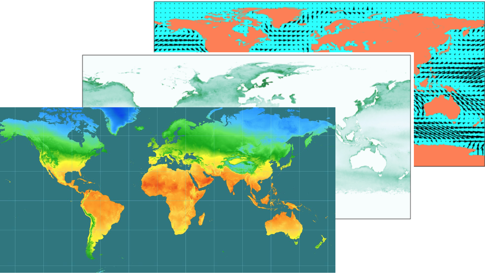

#  Genetic and Environmental Associations {#geassoc}

## Background 
Now that we know how to get environmental layers and plot them in space, for many of the species we are working on, we are not entirely sure which environmental variables are important drivers of populaiton genetic structure or underlying phenotypic traits of interest. 

Let's back up. Now, we have access to multiple layers of environmental layers that span a species range: 
 
```{r, echo=FALSE, out.width='100%'}

```
  
  
And many of us now have genomic data. Here, we used genome-wide reduced representation sequencing to create a spatially explicit map of population structure, called the genoscape, of the Willow Flycatcher.  

```{r, echo=FALSE, out.width='90%'}

```
  
  
What we ultimately want to investigate is how environmental variables are correlated with genetic variation. 

```{r, echo=FALSE, out.width='90%'}
knitr::include_graphics("images/6.0/GEA.Fig1.jpeg")
```

Standing genetic variation associated with current climate gradients theoretically indicates adaptive capacity. However, modeling future adaptation from individual loci is difficult because we don’t understand all GxE interactions.

A recent example illustrated that not only is geography ("isolation by distance") strongly correlated genetic structure, but environment plays a role in differentiation too. Specifically, precipitation is a strong predictor of Yellow Warbler genetic structure. 

```{r, echo=FALSE, out.width='100%'}

```

## Motivation

The R package gradientForest traditionally quantifies multi-species compositional turnover along environmental gradients. In the era of next-generation sequencing, where genome-wide data is common, we can extend this community ecology framework to determine which variants are associated with specific environmental variables. So rather than thinking of the large-scale species turnover in space, we can map fine-scale allele frequency changes along environemntal gradients. 

Gradient forest is a machine learning approach for classification and regression based on decision trees. We've all seen and used decision trees, for mundane tasks like waking up to an alarm each morning to more intricate decisions like optimal pairing of individuals in a captive breeding program to increase/maintain genetic diversity of a population. Regardless of which decision tree you are implementing, the assumption remains, the higher the split, the more important the predictor.

Because decision trees are prone to overiftting, gradient forest uses random forests to test associations. Random forests use a random subset of predictors for each decision tree. 

```{r, echo=FALSE, out.width='100%'}
knitr::include_graphics("images/6.0/RandomForest.ConceptMap.jpg")
```

1) Choose a subset of data and predictors.
2) Find predictor (and value) that optimizes split.
3) Create many trees and aggregate.

**Random forests and genomic data**

Brieuc et al. 2018 used this approach to rank the importance of SNPs for predicting a specific binary phenotype, *e.g.* disease resistance in fish. This is an example of one random tree, which can ultimately create a predictive polygenic model.

```{r, echo=FALSE, out.width='100%'}
knitr::include_graphics("images/6.0/RandomForest.Genomics.jpg")
```

Another interesting study used random forests to find the predictive variants for cold hardiness, which was subsequently used to predict cold injury in the Sitka Spruce (Holliday et al. 2012).

```{r, echo=FALSE, out.width='100%'}

```

**What if we have multiple SNPs AND multiple phenotypes or environments?**
Gradient forest extends random forest to incorporate multiple response variables.

Gradient uses turnover functions to look at total allele turnover across environmental gradients. For instance, GI5, a candidate gene in Balsam Poplar, clearly shows great allele frequency transitions across the mean summer temperature (Fitzpatrick and Keller 2015)

```{r, echo=FALSE, out.width='100%'}
knitr::include_graphics("images/6.0/AlleleTurnover.jpg")
```

If we look at different subsets of genetic variation in Balsam Poplar space

a) reference SNPs,  
b) GI5, a candidate gene for genetic control of bud set and bud flush (Olson et al. 2013)

you can see that different environmental variables predict genetic variation of the reference and candidate genes. *Note* different colors = locally adapted genotypes. 

```{r, echo=FALSE, out.width='100%'}
knitr::include_graphics("images/6.0/Fitzpatrick.Fig5.jpeg")
```

Below is code for quantifying and visualizing intraspecific gene-environment variation across space. As part of The Bird Genoscape Project, we compare present-day gene-environment associations to predicted future changes to identify regions of genomic vulnerability. 

```{r, echo=FALSE, out.width='60%'}

```

For now, this tutorial focuses on analyzing and plotting the allelic variation as estimated from gradient forest for a single species, the Willow Flycatcher, but is easily adpated to include other species and methods for esimating variation.

## Housekeeping
We will need the following R packages. gradientForest requires the dependancy extendedForest, an R package classification and regression based on forest trees using random inputs. With the newest version of R, extended forest is installed automatically as a dependency.

Install and load the following packages in Rstudio. You can use the Packages function to the right to install most packages except for gradient forest, which we will install from R-Forge.

1) As discussed in [Setting Up Your Computer](#setting-computer), if you have a Mac, you 
will need the XCode command line tools.
2) If you have a PC, you'll need Rtools
3) You will also need gfortran on your computer. See the instructions in
[Setting Up Your Computer](#setting-computer) if you don't have that set up
already.

Also, you need to have the package 'gradientForest' installed as
described in the Preface section [The 'gradientForest' package](#grad-forest).

```{r}
#install.packages("gradientForest", repos="http://R-Forge.R-project.org")
library(gradientForest)
library(data.table)
library(raster)
library(gstat)
library(rgdal)
library(sf)
library(RColorBrewer)
library(rasterVis)
library(tidyverse)

```

And we will need to load a realistic, polygon shapefile (an outline of the Willow Flycatcher's breeding range in North America for this exercise) and set its projection. __Note, you will need to adjust the path to the shapefile below. This is the path to my shape file on my computer.__ 

That will produce this map:
```{r}
wifl_shape <-st_read("data/6.0/WIFLrev.shp")
```

```{r, fig.cap = "A basic outline of Willow Flycatcher breeding range we will use for this exercise"}
ggplot(wifl_shape) +
  geom_sf(fill=NA) +
  theme_bw()
```

## Running Gradient Forest
We will use gradient forest to test whether a subset of genomic variation can be explained by environmental variables and to visualize climate-associated genetic variation across the breeding range of the Willow Flycatcher. To run gradient forest we need two main files. First we need the environmental data/climate variables associated with each population. Populations are defined by their latitude and longitude. 

For each sampling location, we obtained environmental data from publically available databases. Specifically, we chose variables with known impacts on bird physiology and ecology and that were publically available at high resolution. These variables included 19 climate variables downloaded from WorldClim (Hijmans et al. 2005) as well as vegetation indices (Carroll et al. 2004) (NDVI and NDVIstd), Tree Cover (Sexton et al. 2013) and elevation data from the Global Land Cover Facility (http://www.landcover.org). We also downloaded and used a measure of surface moisture characteristics from the NASA Scatterometer Climate Record Pathfinder project (QuickSCAT, downloaded from scp.byu.edu).

Read in the environmental variables, and take a look at the dimensions and the actual data.

```{r}
Ewifl<-read_csv('data/6.0/wiflforest.env.csv')
dim(Ewifl)
```

__How many sites do we have environmental data for? How many environmental variables?__

Second, we have genomic data formatted as allele frequencies for each population in the same order. The published Willow Flycatcher data includes 37855 variants, and is too large to run a gradient forest analyses within the time frame of a tutorial, so we are supplying a subsetted dataset limited to 10,000 SNPs. 

```{r}
Gwifl<-read_csv('data/6.0/wiflforest.allfreq.sample.csv')
dim(Gwifl)
head(Gwifl)
```
__These are allele frequencies for each site. What is the range of allele frequencies for allele V3386? You might need to write extra code to answer this question.__

Next we have some housekeeping to define the predictor variables in the regression, which are the environmental variables, and the response variables, which in this case are the frequencies of each variant, analyzed in gradient forest.

Now we run gradientForest with 10 bootstrapped trees to be generated by randomForest. This will take about 5 minutes.

```{r}
preds <- colnames(Ewifl)
specs <- colnames(Gwifl)

nSites <- dim(Gwifl)[1]
nSpecs <- dim(Gwifl)[2]

# set depth of conditional permutation
lev <- floor(log2(nSites*0.368/2))
lev

wiflforest=gradientForest(cbind(Ewifl,Gwifl), predictor.vars=preds, response.vars=specs, ntree=10, transform = NULL, compact=T,nbin=101, maxLevel=lev,trace=T)

##ntree=default is 10, more is better and reduces variance
##gradient forest bins variants, large scale patterns will be seen
##if one variant of large effect, may not be found in this analysis
```

Now we can ask which environmental variables are significantly associated with the allelic structure of Willow Flycatchers (or at least the subset we are looking at).

This first plot and most useful from gradientForest is the predictor overall importance plot, which shows a simple barplot of the ranked importances of the physical variables. This shows the mean accuracy importance and the mean importance weighted by SNP R^2. The most reliable importances are the R^2 weighted importances.

```{r, fig.cap = "Overall importance of predictor variables"}

plot(wiflforest,plot.type="Overall.Importance")
```

__For the Willow Flycatcher subsetted data in this tutorial, what are the top 5 variables?__

Use the code below to look at Cuumulative importance, aka which variants are strongly associated with the top two variables. The cumulative importance is plotted separately for all species and averaged over all species. The cumulative importance can be interpreted as a mapping from an environmental gradient on to biological gradient.

```{r, fig.cap = "Individual and cumulative importance of SNPs associated with top 2 environmental variables"}
plot(wiflforest,plot.type="Cumulative.Importance")
```

__Which SNP has the greatest importance?__ For plotting purposes, only the first two top environmental variables are plotted. So the plots on the left are variants and turnover functions associated with Bio4, and the plots on the right are associated Bio3.

You can confirm this by looking at the range of your top environemntal variables and comparing it to the x-axis in the plots above using this code below:

```{r}
Ewifl %>% dplyr::select(BIO4,BIO3)
```

Note, while gradient forest can look at variants associated with environmental variables like this, we tend to choose the top uncorrelated environmental variables and run latent factor mixed models to identify candidate genes associated with each environmental variable. Why? In gradient forest, we "bin" the variation, so we are looking for large patterns, not individual variants.

## Basic Gradient Forest Preparation

So now that you see how gradient forest is run, let's plot the results in space.

Gradientforest here was based off of 21 locations in the WIFL range. I've randomly chosen 100,000 points within the WIFL range and gotten the evironmental data for these 100,000 sites, which will allow us to have a more continuous view of important environmental associations in WIFL space. Load your 100,000 random points with associated environmental predictors. This can be created with another script that was included with the tutorial material (bioclim&randoms.R), but we'll use the ready-made grid created specifically for Willow Flycatchers.

```{r}
#WIFL current random points, filter out 'bad' points
birdgrid=read.table("data/6.0/wiflcurrentRH.csv",header=T,sep=",") %>% filter(BIO4!="-9999") #load your  random points with assocaited env predictors 
##Let's look at bird grid, untransformed environmental variable
head(birdgrid)
dim(birdgrid)
```

We don't have to use all the predictors in the next steps, in this case, we'll use the top 4 uncorrelated variables. These variables were selected by moving down the list of ranked importance for the full model and discarding variables highly correlated (|Pearson’s r| > 0.7) with a variable of higher importance. You can see the correlations among environmental variables across your sample sites. While it is clearly hard to read here, if you export this and open in excel, you can color code and keep track of the correlations among the ranked variables.


```{r}
head(cor(Ewifl,method="pearson"))
```

For the remaining time in this tutorial we are focusing on the uncorrelated variables determined for the __full__ Willow Flycatcher dataset (Ruegg et al. 2017), BIO11 (Mean temperature of coldest quarter), BIO5 (Max temperature of warmest month), BIO4 (Temperature seasonality (standard deviation *100)), and BIO17 (Precipitation of driest quarter).

Predict across your random sites using your Forest model:

```{r}
predictors_uncor<-c("BIO11","BIO5","BIO4" ,"BIO17")

currentgrid=cbind(birdgrid[,c("X","Y")], predict(wiflforest,birdgrid[,predictors_uncor])) #predict across your random sites using your forest

##Let's look at currentgrid, transformed environmental variables- see how they were transformed
head(currentgrid)
dim(currentgrid)
```

We can summarize the variation using principal components. We then convert those PC axes to RGB values for plotting.

```{r}
#Getting the PCs and Converting Them to RGB Color Values
PCs=prcomp(currentgrid[,3:6]) #run your PCs on your top four variables
# set up a colour palette for the mapping
a1 <- PCs$x[,1]
a2 <- PCs$x[,2]
a3 <- PCs$x[,3]
r <- a1+a2
g <- -a2
b <- a3+a2-a1
r <- (r-min(r)) / (max(r)-min(r)) * 255
g <- (g-min(g)) / (max(g)-min(g)) * 255
b <- (b-min(b)) / (max(b)-min(b)) * 255
wiflcols=rgb(r,g,b,max=255)
wiflcols2=col2rgb(wiflcols)
wiflcols3=t(wiflcols2)
gradients=cbind(currentgrid[c("X","Y")],wiflcols3)
```

The multi-dimensional biological space can be plotted by taking the principle component of the transformted grid and presenting the first two dimensions in a biplot. You've already defined the PCs above and the RGB color palette. Different coordinate positions in the biplot represent differing allele frequency compositions as associated with the predictors.

```{r, fig.cap = "A principle component plot of the top 4 uncorrelated variables"}
##Biplot specifics
nvs <- dim(PCs$rotation)[1]
vec <- c("BIO11","BIO5","BIO4" ,"BIO17")
lv <- length(vec)
vind <- rownames(PCs$rotation) %in% vec
scal <-100
xrng <- range(PCs$x[, 1], PCs$rotation[, 1]/scal) *1.2
yrng <- range(PCs$x[, 2], PCs$rotation[, 2]/scal) *1.2
plot((PCs$x[, 1:2]), xlim = xrng, ylim = yrng, pch = ".", cex = 4, col = rgb(r, g, b, max = 255), asp = 1)
points(PCs$rotation[!vind, 1:2]/scal, pch = "+")
arrows(rep(0, lv), rep(0, lv), PCs$rotation[vec,1]/scal, PCs$rotation[vec, 2]/scal, length = 0.0625)
jit <- 0.0015
text(PCs$rotation[vec, 1]/scal + jit * sign(PCs$rotation[vec,1]), PCs$rotation[vec, 2]/scal + jit * sign(PCs$rotation[vec,2]), labels = vec)
```

__Save this image using the code chunk below. What environmental variables are associated with the colors green, pink and blue? Knowing this will help with the interpretation of plotting this in space.__

```{r}
pdf("stored_results/6.0/WIFL.PCA_uncorrelated.pdf")
nvs <- dim(PCs$rotation)[1]
vec <- c("BIO11","BIO5","BIO4" ,"BIO17")
lv <- length(vec)
vind <- rownames(PCs$rotation) %in% vec
scal <-100
xrng <- range(PCs$x[, 1], PCs$rotation[, 1]/scal) *1.2
yrng <- range(PCs$x[, 2], PCs$rotation[, 2]/scal) *1.2
plot((PCs$x[, 1:2]), xlim = xrng, ylim = yrng, pch = ".", cex = 4, col = rgb(r, g, b, max = 255), asp = 1)
points(PCs$rotation[!vind, 1:2]/scal, pch = "+")
arrows(rep(0, lv), rep(0, lv), PCs$rotation[vec,1]/scal, PCs$rotation[vec, 2]/scal, length = 0.0625)
jit <- 0.0015
text(PCs$rotation[vec, 1]/scal + jit * sign(PCs$rotation[vec,1]), PCs$rotation[vec, 2]/scal + jit * sign(PCs$rotation[vec,2]), labels = vec)
dev.off()
```
With this, we can draw our first gradient forest map:

```{r}
wiflcols=rgb(r,g,b,max=255)
wiflcols2=col2rgb(wiflcols)
wiflcols3=t(wiflcols2)
gradients=cbind(currentgrid[c("X","Y")],wiflcols3)
wiflmap=gradients
coordinates(wiflmap)=~X+Y #setting the coordinates
proj4string(wiflmap) <- CRS("+proj=longlat +datum=WGS84")
```

```{r, fig.cap = "Our gradient forest model of SNP variation in the Willow Flycatcher breeding range"}
par(mar=c(0,0,0,0))
plot(wiflmap,col=rgb(r,g,b,max=255),pch=15)
```

__How would you interpret the different colors on thie WIFL map? Is the endangered southwest Willow Flycatcher locally adapted? __

Let's plot this another way, on a map. To do this, we need some additional shapefiles of North America.

The domain here allows you to crop the shapefiles to just your species range.
```{r}
library(sf)
coastlines <- st_read("data/6.0/ne_shapefiles/ne_10m_coastline.shp")
domain <- c(
  xmin = -140, 
  xmax = -55,
  ymin = 15,
  ymax = 50
)

coast_cropped <- st_crop(coastlines, domain)
```

This code allows you to plot, but also change the domain to what will encompass your species shapefile. Suffice it to say I went through a fair number of iterations to ge it right.

Once you have the shapefiles and cropped domain, you can create a map, project the map, and then crop it to what region you want. Using the above code, the domain can/should be larger than what you will be plotting. You can further crop later!
```{r, fig.cap = "Our gradient forest model of SNP variation in the Willow Flycatcher breeding range on a map"}
library(ggspatial)
countries_cropped <-  st_read("data/6.0/ne_shapefiles/ne_10m_admin_0_boundary_lines_land.shp") %>%
  st_crop(domain)
states_cropped <- st_read("data/6.0/ne_shapefiles/ne_10m_admin_1_states_provinces_lines.shp") %>%
  st_crop(domain)

mapg <- ggplot() +
  geom_sf(data = coast_cropped) +
  geom_sf(data = countries_cropped, fill = NA) +
  geom_sf(data = states_cropped, fill = NA) +
  ggspatial::layer_spatial(wiflmap,col=rgb(r,g,b,max=255),pch=15) +
  #geom_spatial_point(data=Epabu, aes(Long,Lat),col="black") +
   geom_sf(data=wifl_shape,fill=NA) +
  theme_bw() 

#Now, let's see how our developing map looks under such a projection.  We just define `lamproj` as a coordinate reference system and pass it in to `coord_sf()`

lamproj <- "+proj=lcc +lat_1=20 +lat_2=60 +lat_0=40 +lon_0=-100 +x_0=0 +y_0=0 +ellps=GRS80 +datum=NAD83 +units=m +no_defs"


#Plotting, but cutting out rectangle (Don't need a lot of extra space)
rectangled <-mapg +
  xlab("Longitude") + ylab("Latitude")+
  coord_sf(
    crs = st_crs(lamproj), 
    xlim = c(-2200476.8, 2859510), 
    ylim = c(-1899797, 1809910.8),
    expand = FALSE) 
rectangled

```

Rename this file. I put the plot I plotted in here, but let's make sure this works for you!!
```{r}
ggsave("stored_results/6.0/WIFL.GF_map.pdf")
```
## Defining "Genomic Vulnerability/Genomic offset" Given Future Climate Predictions 

The plots above are the genotype-environment relationship given present-day climate rasters. However, we know rapid fluctuations in temperature and precipitation associated with climate change can alter the suitability of particular regions making it necessary for individuals to either adapt, disperse or die if the changes are extreme enough. Those species that possess standing genetic variation for climate-related traits (i.e. have adaptive capacity) are most likely to have the ability to adapt to rapidly changing environments. Those species that unable to adapt are deemed most vulneraable.

To investigate which populations might be most vulnerable to future climate change, we defined the metric “genomic vulnerability” as the mismatch between current and predicted future genomic variation based on genotype-environment relationships modeled across contemporary populations. We followed the method presented in Fitzpatrick and Keller (2015) to calculate genomic vulnerability using an extension of the gradient forest analysis. Populations with the greatest mismatch are least likely to adapt quickly enough to track future climate shifts, potentially resulting in population declines or extirpations.

Here, we read in the future climate predictions for each random point. Since different amounts of heat-trapping gases released into the atmosphere by human activities produce different projected increases in Earth’s temperature, we provided two such predicted models: the 2.6 emission predictions and the 8.5 emission predictions for the year 2050. 

The lowest recent emissions pathway (RCP), 2.6, assumes immediate and rapid reductions in emissions and would result in about 2.5°F of warming in this century. The highest emissions pathway, RCP 8.5, roughly similar to a continuation of the current path of global emissions increases, is projected to lead to more than 8°F warming by 2100, with a high-end possibility of more than 11°F. Each of these is a composite of multiple prediction models and have rather different predictions.

```{r}
future1<-read.table("data/6.0/wiflfuture2-6-2050.csv",header=T,sep=",") %>% filter(BIO4!="-9999")
head(future1)

future2<-read.table("data/6.0/wiflfuture8-5-2050.csv",header=T,sep=",") %>% filter(BIO4!="-9999")
head(future2)
```

We then use our gradient forest model to transform these into "biological space" just as we did for random points across contemporary environments.

```{r}
futuregrid=cbind(future1[,c("X","Y")],predict(wiflforest,future1[,predictors_uncor]))
```

Finally, we calculate genomic vulnerability. Mathematically, for a given point this is the __Euclidean distance__ between the current biological space (currentgrid) and the future biological space (futuregrid):


```{r}
coords<-birdgrid[,c("X","Y")]
euc <- matrix(data=NA,nrow=nrow(futuregrid),ncol=3)
for(j in 1:nrow(currentgrid)) {
  euc[j,] <- c(as.numeric(coords[j,]),as.numeric(dist(rbind(currentgrid[j,],futuregrid[j,]))))
}
euc <- data.frame(euc)
names(euc) <- c("Long","Lat","Vulnerability")
```

This again takes a moment. Once we have this metric, we can easily map genomic vulnerability across the range. First by choosing a color palette, then by converting a dataframe of distances to a spatial polygon and giving it the same extent as the map it's going to be plotted on and finally, mapping in ggplot.

```{r,fig.cap = "Heat map of genomic vulnerability under the 2050 2.6 emission future prediction"}
colramp2=brewer.pal(n = 9, name = "RdYlBu")[c(1:9)]
Futcolors<-colorRampPalette(colramp2)

euc_sp<-st_as_sf(euc,coords=c("Long", "Lat"))
st_crs(euc_sp) <- st_crs(coast_cropped) 

mapg <- ggplot() +
  geom_sf(data = coast_cropped) +
  geom_sf(data = countries_cropped, fill = NA) +
  geom_sf(data = states_cropped, fill = NA) +
  geom_point(data=euc,aes(x=Long,y=Lat,color=Vulnerability),pch=15) +
  scale_colour_gradientn(colours = Futcolors(100))+
   geom_sf(data=wifl_shape,fill=NA) +
  theme_bw() 

mapg
```


__How does this look if we plot the second scenario of higher gas emissions? Compare and contrast the two scenarios, keeping in mind that the colors are scaled within each scenario.__

```{r}
futuregrid2=cbind(future2[,c("X","Y")],predict(wiflforest,future2[,predictors_uncor]))

coords<-birdgrid[,c("X","Y")]
euc2 <- matrix(data=NA,nrow=nrow(futuregrid2),ncol=3)
for(j in 1:nrow(currentgrid)) {
  euc2[j,] <- c(as.numeric(coords[j,]),as.numeric(dist(rbind(currentgrid[j,],futuregrid2[j,]))))
}
euc2 <- data.frame(euc2)
names(euc2) <- c("Long","Lat","Vulnerability")
```

```{r, fig.cap = "Heat map of genomic vulnerability under the 2050 8.5 emission future prediction"}
euc_sp2<-st_as_sf(euc2,coords=c("Long", "Lat"))
st_crs(euc_sp2) <- st_crs(coast_cropped) 

mapg2 <- ggplot() +
  geom_sf(data = coast_cropped) +
  geom_sf(data = countries_cropped, fill = NA) +
  geom_sf(data = states_cropped, fill = NA) +
  geom_point(data=euc2,aes(x=Long,y=Lat,color=Vulnerability), pch=15) +
  scale_colour_gradientn(colours = Futcolors(100))+
  geom_sf(data=wifl_shape,fill=NA) +
  theme_bw() 

mapg2
```
